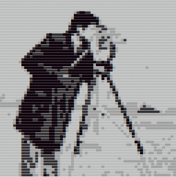
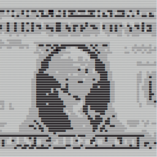
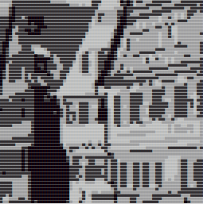
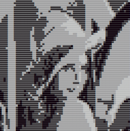
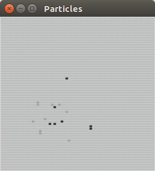
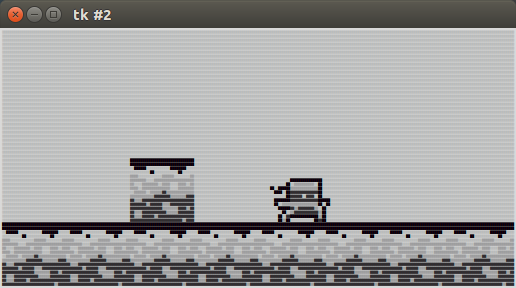

# calcium
Python 2/3 ascii/text game library. See examples

Images from http://www.hlevkin.com/default.html#articles

       

#### monochrome.py
In `tools/spriter.py` one pixel is created using two characters, in `tools/monochrome.py` four pixels are create using two characters.
This is better to make terminal applications where normally we have only 80x24

## calcium.py
#### CalciumScreen
Represents the virtual ascii screen. It has the `get_string` method that returns the string/ascii representation of screen. You can use this method to "plot" the screen in any place you want. The `window` module is a implementation of calcium classes in tkinter/tk. The `clear_color` property controls the color used to clear the screen. Any color is a integer between 0 and 3 representing the level of color. The levels are the 4 characters: █, ▓, ▒, ░.

##### clear
erase all screen content and fills the screen with the `clear_color`

##### get_string
get the string representation of screen

##### set_pixel(x, y, level)
"Plot" a pixel in (x, y) position with the color `level`. The level must be a integer between 0 and 3.

##### plot(sprite)
Receives a sprite and plot all pixels if it in screen.

Example:
```python
import calcium
screen = calcium.CalciumScreen(64)
screen.set_pixel(30, 30, 0)
# you can use "get_pixel" or just cast to string (__repr__)
print(screen)
```

#### CalciumSprite
The CalciumSprite is a collection of pixels. It receives a position and a dictionary with frames.
